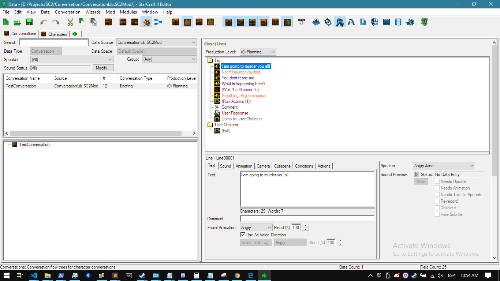
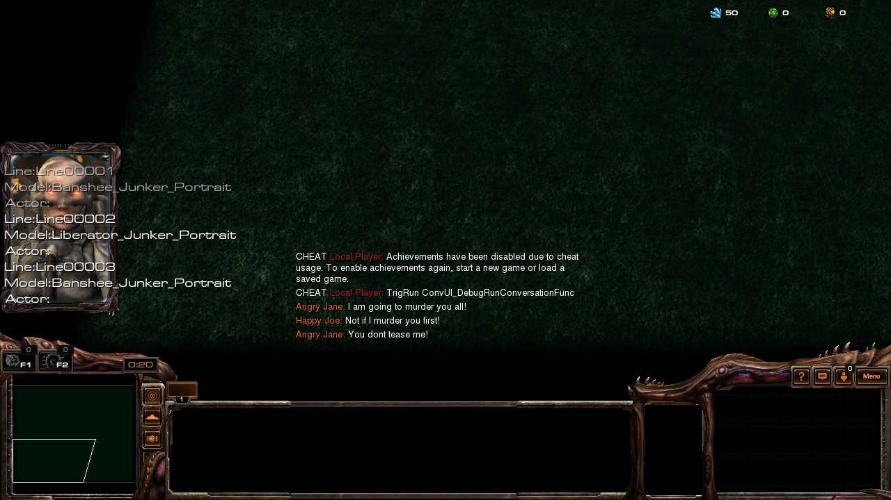
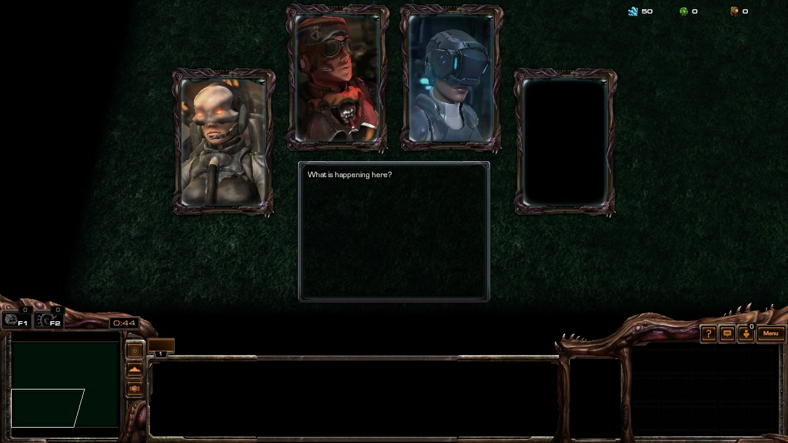
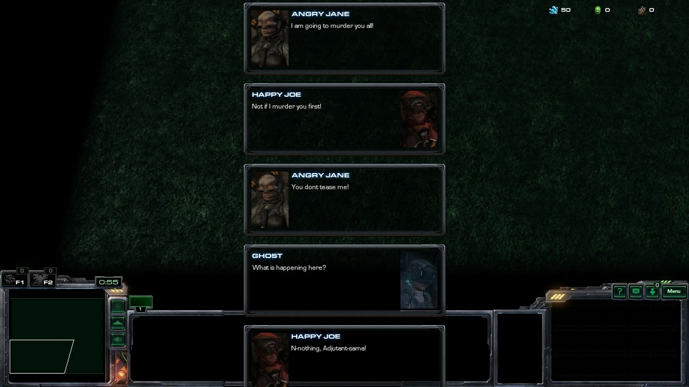

# sc2-conversationlib

ConversationLib is a StarCraft 2 mod aimed to add more support for data driven conversations. StarCraft 2 has a dedicated datatype for conversations, with support for having player driven choices, conditional execution, jumping around between groups of dialogue lines, etc. The major problem with it is that its API is extremely limited, and doesnt allow for much customization as to how to render your conversation, nor it easily allows for extended behaviour through the game's own scripting system.

The mod aims to emulate the existing internal data types for data driven conversations, and transform the existing data conversations into its emulated form via the game's Catalog API.

## Roadmap
- [x] Parsing Lines
- [x] Parsing Waits
- [ ] Parsing Choices
- [x] Parsing Jumps
- [ ] Parsing Run Actions
- [ ] Parsing Conditions
- [x] Implementing Callbacks for each subtype

## Demonstration

Given the following conversation done via the built-in Data Editor:

With a given set of callbacks in can be rendered in different ways, like:

 * Classic ingame transmissions:
 
 
 
 * Emulated StarCraft 1 briefing rooms:
 
 
 
 * Custom UI:
 
